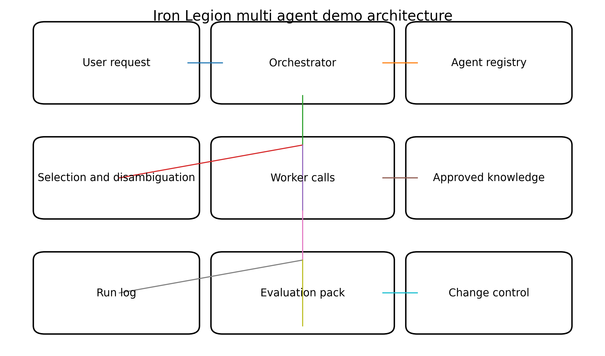

# Iron Legion Multi Agent Demo Case Study

Runnable multi agent case study that demonstrates orchestrator to worker routing, agent registration, deterministic selection and disambiguation, and audit ready run logs.

This repository is public safe. It contains no tenant identifiers, no internal urls, no secrets, and no proprietary data. The goal is to show the engineering patterns that make agentic systems reliable at scale.



## What this repo proves
This is not a slideshow. It is executable evidence of multi agent behavior.

You will see
1. An orchestrator that routes intent to specialized workers
2. An agent registry that controls what workers exist and what actions are allowed
3. A task envelope schema used for every worker call and every response
4. Selection and disambiguation gates that block targeted actions when required identifiers are missing
5. Structured run logs that capture every hop for audit and debugging
6. End to end scenarios you can run locally in minutes

## Why multi agent
Single agent designs break down when scope grows.
Multi agent systems scale better when you enforce boundaries and contracts.

Benefits
1. Smaller workers with clear responsibilities
2. Lower blast radius when something fails
3. Better observability because every handoff is logged
4. Easier testing because each worker contract is narrow

Tradeoffs
1. More structure to maintain
2. Requires governance or it still drifts

## Repo layout
docs  
Narrative case study and specifications

src  
Orchestrator, registry, worker contracts, and worker stubs

demos  
Scenario inputs and generated run logs

tests  
Test pack and scoring rubric

assets  
Architecture visuals

governance  
Change control and change log

redaction  
Public repo checklist

## One minute reviewer path
If you are reviewing this repo quickly, do this.
1. Read docs/01_Executive_Summary.md
2. Open docs/04_Task_Envelope_Spec.md
3. Run Scenario 02 and confirm execution stops for missing selection
4. Open the generated JSON log in demos/runs and review the audit trail

## Quick start
Requirements
Python 3.11 or later

Run a scenario
```bash
python demos_run.py scenario_01_sharepoint_read.json
